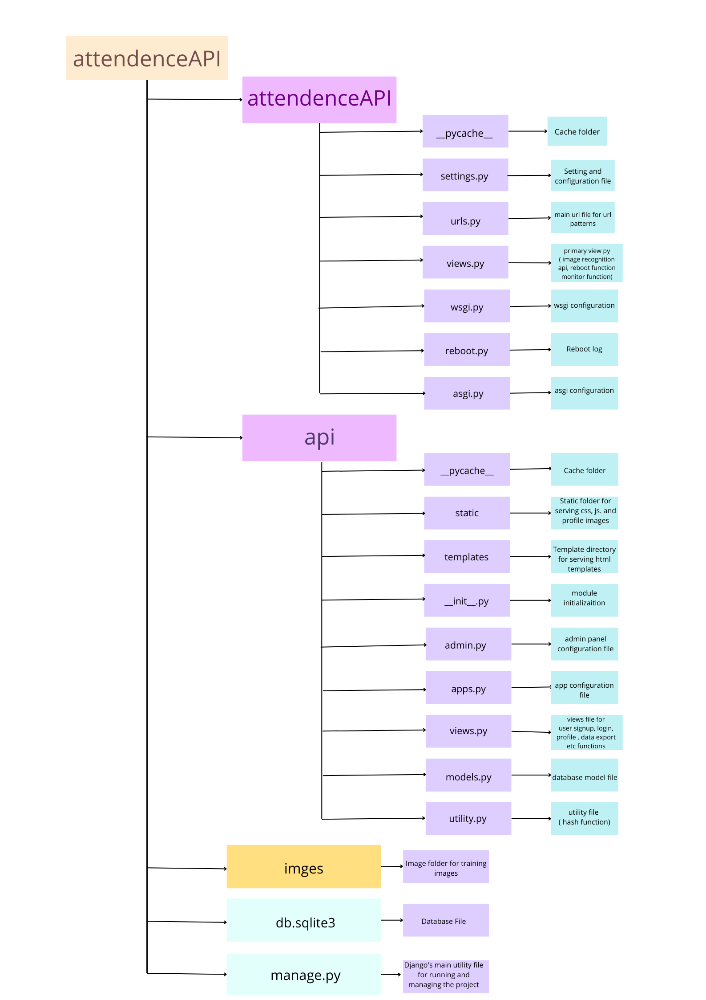

<div align="center">

# Face-Recognition
## Attendance System 
  
<div>

</div>


[](https://code.visualstudio.com/)
[](https://github.com/File_authentication)
<br/>


</div>


<div >
  <div align="center">Link of Figma design : 
  <a href="https://www.figma.com/file/n6zN6WsPpC3Fq7KmB8zADR/face-recognition?node-id=0%3A1"> @Figma </a> </div>
</div>

#
## Features
1) Detects face in Real time and Create attendance Logs
2) Mark my attendance option for students/attendees
3) Password authentication for user signup and login
4) User can download attendance report in CSV format for current month
5) Profile Update option for user
6) Monitor Attendees feature for admin user to monitor all the attendees in real time
7) Admin can add new user to the system and upload training image from admin panel
8) Report Download option for admin user to download attendance report in CSV format for all user for the given year & month
9) Data visualization for attendance report for the current month
10) Option for admin to retrain newly added image data
11) Attendance log view feature with filter and pagination for Admin user

#
## Installation

> Running development server in Local Mechine 
> 


#### [ Pre-requisite ] : 
- Python 3.6 or above
- dlib library
- python-virtualenv

#### [ step 1 ] :
- clone the repository
``` 
git clone https://github.com/aaravchanani4/Face-Attendance_App.git
```
#### [ step 2 ] :
- Open terminal and navigate to the directory
```
cd engage-face_recognition
```
#### [ step 3 ] :
- Create virtual environment
```
python -m venv venv
```

#### [ step 4 ] :
- Activate virtual environment
```
source venv/bin/activate
```
#### [ step 5 ] :
- Install dependencies
```
pip install -r requirment.txt
```
#### [ step 6 ] :
- Run the server
```
python manage.py runserver
```

<br>

### Admin Credentials
    Username:admin
    Password:msengage
#
## Uses
1) Mark attendance easily by using face recognition api.
2) Can directly download the attendance of every student in excel format.
3) It is Cost-Effective as it can save business resources by automatic student time tracking.
4) More Accurate and Better Student Attendance because no proxy system will be there.
5) As compared to manual attendance systems, AI-based attendance systems are highly automated and easy to manage.

#
## Architecture
<div align=center>

</div>

- This system have 2 types of user
- Normal user can mark their attendance, but before that 
  - User has to signup
  - User has to login using their email and password
  - Admin has to verify the user and add his/her training image 
  - Admin has to restart the server using the reboot button in the admin home page
    - There are 2 image fields in the Attendee table , one is for the training image and other is for the user profile image
    - user can update and add profile image 
    - For trainingg image only admin has the permission to update that and reload the server

- Admin home page has monitor attendance option
  - Admin can monitor all the attendees in real time
  - Admin can download attendance report in CSV format for all user for the given year & month
  - Admin can retrain newly added image data
  - Admin can view attendance log view feature with filter and pagination for Admin user


#
## Directory Structure
 <div align=center>

</div>


#
## Demo
<br>

<br>
